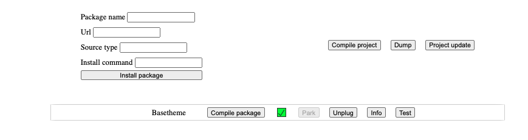

##maintenance panel workings

Before we dive in, please note that this is still in its infancy stages and thus a lot of what is here may change 
drastically as time goes by but will try to keep the docs updated as much as I can. <br>
so how have this been constructed. to begin with following are what we need to achieve:
- Ability to install a package via the maintenance panel
- Ability to compile, composer dump and composer update the project from the maintenance panel.
- Once a package is installed, from the maintenance-panel we should be able to:
    * compile package (here basically load package assets first to the base project and then compile project assets)
    * need the ability to plug in and plug out the installed package cleanly.
    * Show package info whenever needed
    * finally test if a package is installed 


Lets get to the technical bits now, how exactly have the above been achieved. 

###### Initialization
To begin with, we know that this should be done via the browser. So first of we need some entry page where we can
make this actions available to the user. And this can be accessed by visiting `/maintenance-panel`, there we 
return a simple page with the forms that make this actions possible: 

From above
You'll notice the four main project actions: 
- install a package
- compile the project
- dump 
- project update

<ins>Install a package: </ins> <br/>
When we want to install a package, fill in the form specifying its source: (either a vcs or path). This will update
your composer.json to require this package and update the maintenance-panel config to accept this package, but hold 
it up first. Next up, you will need to install the given package into the project which is where the `package update` 
comes in, which basically  pulls in whatever is in the controller, next  up, its advisable that you run dump which in the
background will run `composer dumpautoload`
 
<ins>compile project</ins> <br/>
Here we are basically running npm run dev to compile assets to the public directory specifics (js and css);
Upon package installation, you can as well compile, plug in (park) and unplug the package.

###### Let's get technical now: 
Try first of in your terminal under the core, having installed the maintenance-panel to run the following artisan command
`php artisan maintenance-panel:setup -h` (Park above for now)

Let's get to the image we saw above which presents forms which the user interacts with to 
perform the different actions. All this forms submit to `SetupController@setup` where the controller in this case only 
validates the form submitted and that there is indeed a valid action. 

```php 
$data = request()->validate([
    'action' => 'required|in:install_package,dump,compile,update_project',
    'package_name' => 'required_if:action,install_package',
    'url' => 'required_if:action,install_package',
    'source_type' => 'required_if:action,install_package',
    'install_command' => 'required_if:action,install_package',
]);
```

From the above, you will notice the `action` field in the data array, which is a required field with four
maing options: 
- install_package,
- dump
- compile,
- update_project <br/>

Yes you thought it right, this directly corresponds to what we are to  actually do as we discussed in the
introduction bit. <br/>
From the controller, we now call the artisan command you had run earlier from the terminal but this 
time from the controller `Artisan::call('maintenance-panel:setup', ['action' => $data['action']]);`. As
seen from the given code, we pass the given action to the command as an argument. 

The command here using a ***switch statement*** loops calls the correspondent action against each of the
cases above except for the `install_package` option. (we will look at this option later) <br/>
For now, lets go over the other cases, here you will notice that the above cases directly correspond to some
terminal actions:
- dump - `composer dump`
- compile  `npm install && npm run dev`,
- update_project  `composer update` <br/>

And the given functions called by the switch statement for each of the above cases basically runs this 
terminal commands on the core of the application by calling the following php function: 
```
shell_exec('cd ' . $project_path . ' && ' . $command);
```

<ins>Install package</ins>

Yes we earlier had parked this, let's now look at how you install a different package in to the core 
through the maintenance panel. <br/>
Unlike the scenario we looked at above, where we don't need to know much, when installing a package, 
we definitely need to know a couple of things which you may have observed in the image above or when
we were validating form values under setup. This fields are: 
- `package_name`  (here you will basically provide the package name as is on github)
- `url` (here you will provide the url which can either be a relative path to composer.json or a vcs link)
- `source_type` (the source type here is basically either a path or vcs)
- `install_command`( for each package to work with the maintenance panel, it should have it should  provide
  its own artisan install command which is what you supply here).
  

I had earlier mentioned that form is sent to `SetupController@setup` which checks if the action is 
`install_package` if so, from the `SetupRepository` we call `preparePackageInstallation` function which
does exactly as its name says which is to prepare the package for installation which in it is to add the package
to the core composer.json as well as notify the maintenance-panel config that there is  new package with the given
name and what its different attributes are: 
```php
<?php return array (
  'packages' => 
  array (
    'basetheme' => 
    array (
      'installed' => 'false',
      'source_type' => 'path',
      'url' => 'package-dev/vivinet/basetheme',
      'install_command' => 'basetheme:setup',
    ),
  ),
);
```
This is basically some sort of database for the maintenance panel. This is where it does retrieve the
given packages from, which is what you see on the frontend form. 


<ins>Installed package</ins>
Let's now look into the installed package, this as well has it's own different actions different from the 
maintenance panel. It's processing is also different as this is sent to `SetupController@packageSetup` which
just as the earlier, first validates the form inputs: 
```php 
$data = request()->validate([
    'package' => 'required',
    'action' => 'required|in:load_assets,compile,plug_in,unplug,info,test'
]);
```
Well this looks simple right!!, that is because it is, here all we need is the action and the package name.
And as seen from the validator, the actions here are several: 
- load_assets,
- unload_assets,
- compile
- ~~park~~ plug_in (or install)
- unplug
- info
- test

The reason this is quite simple is because we basically don't do nothing much in the maintenance panel,
except call the package install command and pass the given action except for the cases of `unplug` and `park`
For unplug, we basically call `unplugPackage` from the repository which just
- unloads the package assets
- remove its reference from the core composer.json
- finally run composer update and composer dump to effect the changes

Park will do the reverse of the above
